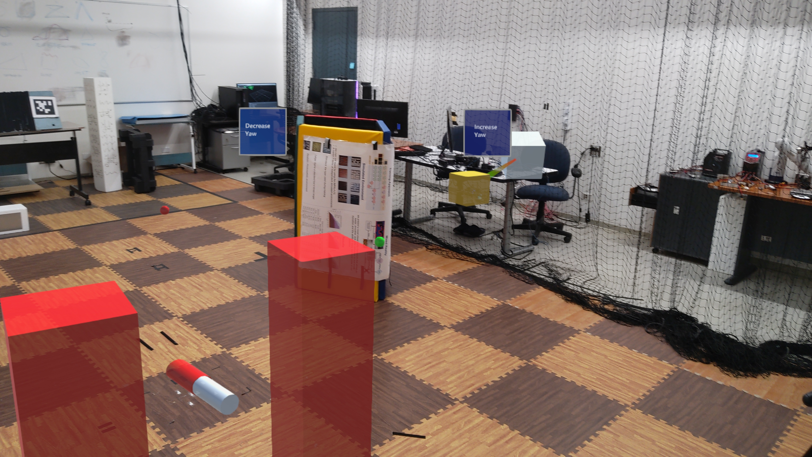

	# MRI ROS
A Mixed Reality Framework for Human Robot Assisted Interaction.
## License
Please be aware that this code was originally implemented for research purposes and may be subject to changes and any fitness for a particular purpose is disclaimed. To inquire about commercial licenses, please contact Luca Morando (luca.morando@nyu.edu) and Prof. Giuseppe Loianno (loiannog@nyu.edu).
```
    This program is free software: you can redistribute it and/or modify
    it under the terms of the GNU General Public License as published by
    the Free Software Foundation, either version 3 of the License, or
    (at your option) any later version.

    This program is distributed in the hope that it will be useful,
    but WITHOUT ANY WARRANTY; without even the implied warranty of
    MERCHANTABILITY or FITNESS FOR A PARTICULAR PURPOSE.  See the
    GNU General Public License for more details.

    You should have received a copy of the GNU General Public License
    along with this program.  If not, see <https://www.gnu.org/licenses/>.
    
```
## Citation
If you publish a paper with our framework, please cite our paper: 
```
@article{MR_human_robot,
  title={Spatial Assisted Human-Drone Collaborative Navigation and Interaction through Immersive Mixed Reality},
  author={Morando, L. and Loianno, G.},
  journal={International Conference on Robotics and Autonomous Systems (ICRA)},
  year={2024}
}
 ```
## Overview
#### Description
This framework provide a spatial assisted human-drone collaborative navigation and interaction through immersive mixed reality. It incorporates novel human drone interaction modalities for a 
completed assisted navigation, inspection or exploration in constrained environments. While operating the robot, the user can rely on a mixed and merged perception, 
which increases his/her knowledge of the surrounding space looking to the environments through the eyes of the aerial robot companion. 
The framework is planned to be adapted in preparation of a future human case study. 

If you have any questions regarding the repo or how to use the framework please feel free to post questions in the Issues. 




**Developer: Luca Morando<br />
Affiliation: [NYU ARPL](https://wp.nyu.edu/arpl/)<br />
Maintainer: Luca Morando (lm4725@nyu.edu)<br />**

## ROS Organization
The ROS Organization is shown in the figure below. 

The table below also summarized the publication and subscription scheme for the algorithm control pipeline.


**Topics**
| Topic                                               | Input / Output | Description                         |
|:----------------------------------------------------|:---------------|:------------------------------------|
| /basic_controls/feedback                            | Input          | Rviz Interactive Marker             |
| /keyboard_input/case_switcher                       | Input          | Take Control and change Yaw         |
| /obstacles_force_field                              | Input          | Force Acting on the robot from the obstacles |
| /planner/path                                       | Input          | Planner Computed Path               |
| /planner/start_assistive_guidance                   | Input          | Start APVI Mode                     |
| /planner/final_goal_reached                         | Input          | Stop  APVI Mode                     |
| /planner/final_goal                                 | Input          | Planner Final Goal Coordinates      |
| /planner/exit_search_mode                           | Output         | Stop Planner Execution              |
| /planner/path2D_to_unity                            | Output         | Publish the Waypoints to Unity      |
| /planner/exit_search_mode                           | Output         | Stop Planner Execution              |


The table below also summarized the publication and subscription scheme for the algorithm perception pipeline.
**Topics**
| Topic                                               | Input / Output | Description                         |
|:----------------------------------------------------|:---------------|:------------------------------------|
| /cloud_in_rep_                                      | Input          | Robot Pointcloud                    |
| /from_Unity/start_stop_mapping                      | Input          | Start Stop Mapping Command         |
| /from_Unity/restart_mapping                         | Input          | Restart mapping Command             |
| /voxblox_node/mesh                                  | Input          | List of Vertices and Indexes for the mesh     |
| /voxblox_node/surface_pointcloud                    | Input          | Octomap Pointcloud                   |
| /from_unity/mocap_frame_in_unity_world_coo          | Input          | TF Frame used in Unity (Cylinder in MR)             |
| /hololens_position                                  | Input          | Hololens Position     |
| /planner/virtual_obstacles_coo                      | Input          | Virtual Obstacles Coordinates            |
| /surface_mesh                                       | Output         |Organized Mesh for unity and Rviz Visualization     |
| /f_obs_vector                                       | Output         |RVIZ Visualization Marker for the Force Vector from the obstacles                                             |
| /cloud_in_rep_                                      | Output         |Republished RP for Voxblox          |
| /drone_mesh_to_unity_as_pointcloud                  | Output         |Drone Mesh Vertices as Pointcloud           |
| /obstacles_force_field                              | Output         |Force Vector from the obstacles            |


## Parameters Files
These files are used to set properties of the control pipeline (in file tele_control_parameters.yaml).
|Name|Description|
|---|---|
|`desired_txt_folder_name`|Folder Name to Save Log Files |
|`log_files_directory`|Log Files Directory in your PC|
|`scenario`|Define how to run the application (i.e.: only sim, real + Rviz, real + MR)|
|`visualization_frame_id`|Name of the connecting frame between real and MR|
|`visualize_force_history`|if true visualize a history of Obstacle Forces Vector in Rviz starting from the robot frame|
|`clear_path_history_after_sec`|Time to delete the robot path in Rviz|
|`safety_boundaries`|Room Safety Boundary Coordinates|
|`n_average_stamps`|Array length to average the user desired position (makes the robot movement smoother)|
|`admittance_gains`|Define the Mass, Spring and Damping in along X, Y axis, the damping function and saturation values|
|`force_gains`|Modeling of the Virtual Force Gains|

These files are used to set properties of the perception pipeline (in file perception_params.yaml).
|Name|Description|
|---|---|
|`in_simulation `|True or False if running in Simulation |
|`horizon`|Drone Horizon where the Obstacle Virtual Force is perceived|
|`lamda`|Exponential Decay param|
|`Fs`|Obstacle Force Maximum Value|
|`mesh_publish_period`|Time to publish mesh in unity|

## Dependencies and Installation
The MRI ROS package is dependent on `Python 3.8` and `ROS Noetic/Melodic`. Please ensure `Python 3.8` as other python versions may lead to build and import errors. Python packages including `numpy`, `scipy`, and `cvxopt` should be installed with `pip install`. 
```
$ pip install numpy==1.22.1
$ pip install scipy==1.8.0
$ pip install cvxopt==1.2.7
```

Moreover, The MRI_ROS package is also dependent from: 

- Opencv 
- pcl msgs:  [PCL MSG](https://wiki.ros.org/pcl_msgs)<br />
- PCL :  [PCL ](https://wiki.ros.org/pcl_ros)<br />
- Cv Bridge:  [PCL ](https://wiki.ros.org/cv_bridge)<br />
- Image transport:  [Image Transport](https://wiki.ros.org/image_transport)<br />
- Voxblox (provided with this repository)


Our software, at least for preliminary test is also dependant by our custom made quadrotor simulator. Since it is a private repository we can not open source at the time, but please have a look to this google drive folder where all the packages required to run the simulation are provided as ROS executables  [ROS Executables](https://drive.google.com/drive/folders/1IAsSDs-94kWY_EIdiKLBK7TL68ThhSf1?usp=drive_link)<br />

To install the executables plese run the following commands inside the downloaded folder: 

```
chmod +x install_binary.sh 
./install_binary.sh 
```
All the binaries file will be installed in /opt/ros folder. 

After installation of necessary packages, clone the repo and `catkin build` the ROS workspace. Source the `setup.bash` file inside the devel folder.

```
$ cd /path/to/your/workspace/src
$ git clone --branch developing https://github.com/arplaboratory/mri_ros.git
$ catkin build
$ source ~/path/to/your/workspace/devel/setup.bash
```


##  Running in Simulation 
### 
The files required to run the pipeline are available here:  [PCL ](https://drive.google.com/drive/folders/1o9JGXbpEEPKWvqe46o7JO6N7fYgehX05?usp=drive_link)<br /> 
- Set the parameter Scenario=1 in the file tele_control_params.yaml.
- Change the name of the odom topic, placing quadrotor in mav_name. 
- launch the file launch_drone_teleoperation.bash with the following command:

```
$ ./launch_drone_teleoperation.bash 
```
Once launched select the option number 1, then type "map1" when the prompt is asking for a rosbag with a map already stored. 
The simulation appear with the robot on the ground. Press "Motors On" and "Take Off" to start the session. 
Once the robot reaches the desired height, press "Take Control" in the RVIZ GUI. 
After pressing teh button, the robot is now under the user control, who can interact moving the grey cube visualization marker. 

- To start the planner session press "APVI" button in RVIZ GUI.

##  Running in Real World
The provided code as been tested with our control pipeline (unfortunately not available) for the public installed on a modalai voxl V1 (also V2 has been tested). 
To run on your custom quadrotor you need to adapt the control and the perception interfaces. 

Perception: 
- Our framework subscribe to a pointcloud message defined as sensor_msgs::PointCloud2. The standard name of the topic is /cloud_in but in case of necessity the topic can be remapped in the launch file Kimera_data.launch inside scene_understanding_pkg. 

Control: 
- Our framework needs an odoemtry topic as input (which can be remapped in the launch file Kimera_data.launch and tele_control_voxl_rviz_real.launch)
- The output is a position and a velocity command. An example of the custom message used is visible in  quadrotor_msgs/msg/PositionCommand.msg 


N.B. 
- To save the log file provide a directory in the first line of drone_teleoperation/cfg/tele_control_params.yaml.
- To have a better experience in simulation, please download a rosbag with a preloaded map from [Here ](https://drive.google.com/drive/folders/1H3-JdphPuvJn6lQ2G43YSPgsMYo6cOqw?usp=drive_link)<br />. The rosbag needs to be stored in a folder called rosbag inside your ws. 
 

#### Rviz Interaction 
!!!!! Remeber this file needs to be modified with your current settings and directories. 
- Set the parameter Scenario=3 in the file tele_control_params.yaml.
- Change the name of the odom topic, placing the mav_name (i.e.: if voxl, type voxl#, where # is the number associated to the mav).
- launch the file to set up the Vicon and the ros master connection:
```
$ ./launch_voxl3_bash_vicon.bash 
```
- launch the file launch_drone_teleoperation.bash with the following command:
```
$ ./launch_drone_teleoperation.bash 
```
- Press 2 to launch the code in the modality real world with RVIZ or Hololens. 
- Press "Motors On" and "Take Off" to start the session (You should connect your command associated to your contorl pipeline). The functions are inside drone_teleoperation/src/admittance_hri_server.c
 
To launch the planner or to take the contrl of the robot the commands are the same of the previous robot. 


#### Unity Interaction with Rviz Visualization
In this scenario you can connect the Robot simulation to the application running on the Hololens. 


In this scenario you need to have a Microsoft Hololens 2, currently set up with Mixed Reality Toolkit and the repository (place the MR Unity rep) correctly build as MR application (check ou the repository for more informations). 

! The unity code along with a detailed documentation is available [Unity Code ](https://drive.google.com/drive/folders/1aqCRvuVcLjoS1yABZeD4DWYS9Q3jUAa9?usp=drive_link)<br />.


The pipeline to correctly start the session is the following: 
- On the Hololens, navigate to the app menu and select "Scene_understanding_project_ros". 


On the PC:
- Set the parameter Scenario=2 in the file tele_control_params.yaml.
- Change the name of the odom topic, placing the mav_name (i.e.: if voxl, type voxl#, where # is the number associated to the mav).
- launch the file to set up the Vicon and the ros master connection (Beaware to change the ros ip in your bashrc where the roscore is actually running. This is fundamental to connect properly the rosmaster with the Unity app through TCP connection)
```
$ ./launch_voxl3_bash_vicon.bash
```
- launch the file launch_drone_teleoperation.bash with the following command:
```
$ ./launch_drone_teleoperation.bash 
```
Select option 1. 

# Interaction in Mixed Reality
The user can choose to interact in a scenario loaded in a real scale or in miniaturized one called minimap. 
The user has to say "lock frame" to visualize the robot holograms change color from white to orange. 
Once the robot is flying, the user can pinch and drag the white interactive cube to move the robot around in the real world. 
If the Octomap is enabled, a mesh representing the discovered surfaces is build in the MR app while the robot is exploring the environment. 
The vocal commands to interact with the mapping are: 
- "Start Mapping": The robot start to map. 
- "Stop Mapping": to pause the mapping. 
- "Reset Map": to reset and re-start a new mapping session. 

A full menu with all the available commands is available inside the application. 

#### Hololens Interaction in real world
This is the latest option available. As the previous section, in this option you need to be equipped with ypur platform. 
The pipeline, once properly adapted to ypur platform is similar to the one discussed in [Unity Interaction with Rviz Visualization].
The only difference is that you have to select 2 once launched "launch_voxl3_bash_vicon.bash" file. 

